# School District Analysis

### Backgroud 

The grades of the ninth graders at Thomas High School have been changed.

- Replace the ninth-grade math and reading scores from Thomas High School.
- Keep all other data associated with the ninth-grade students and Thomas High School intact.

### Redo the School District Data Analysis

1- How is the district summary affected?
#### The district and school summary

Before Remove

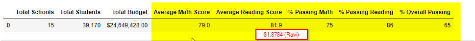

After Remove

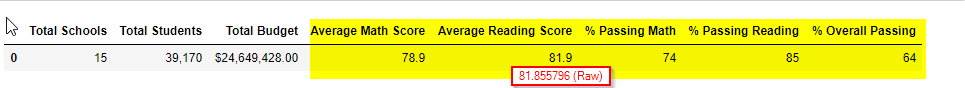

- The Average Math Score, % Passing Math, % Passing Reading, and % Overall Passing metrics of the district are descreased about one (1) and  Average Reading Scores are very close (different 0.02).
The descreased numbers in metrics says that Thomas School 9th grade scores of Math and Reading are higher than the district average scores, and Average Reading Scores might be the same level or lower than the district level. 
However, the descrease is not large because the 9th grade students of Thomas school is small number to compare to the whole district students.
- The Total Schools, Total Students and Total Budget are not affected by the scores so they are the same

2- How is the school summary affected?

#### School Summary

Before Remove

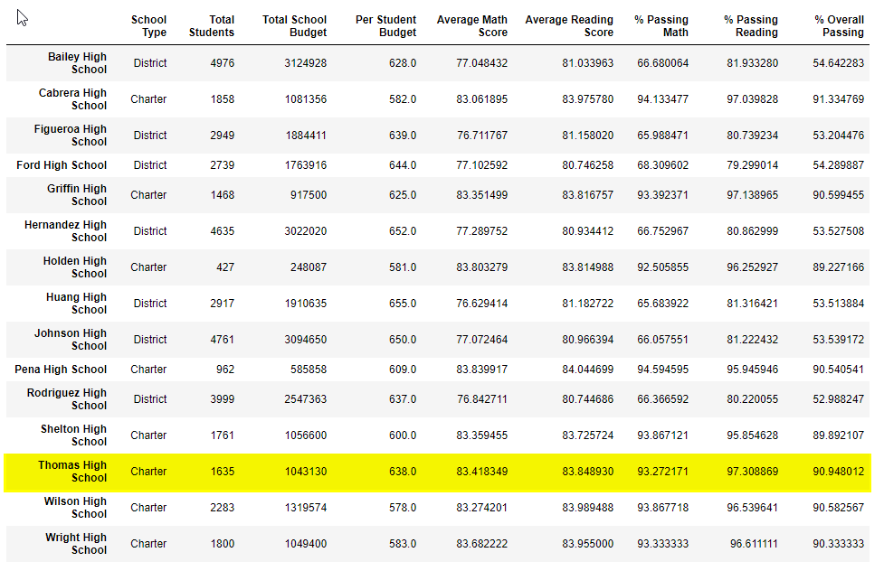

After Remove

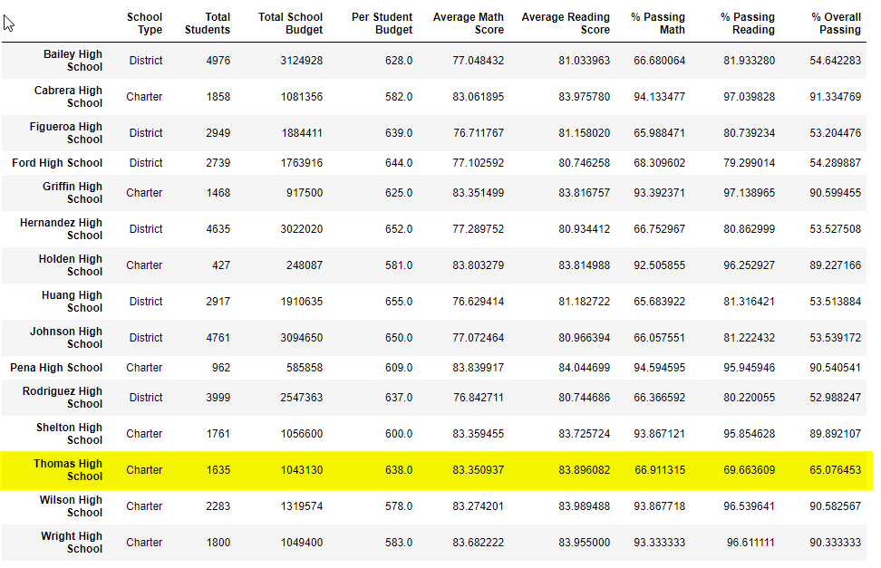

- The School Type, Total Students, Total School Budget, Per Student Budget are the same before and after because they are not affected by scores
- The Average Math and Reading scores of Thomas High are not much different before and after. It says that 9th grade scores are the same average level score of other grades
- The %Passing Math , Reading, and Overall of Thomas High are significant drop. It was about 25% different. The 9th grade student scores plays a significant role in the % passing numbers. All numbers of "Before remove" chart says that the 9th grade's Math and Reading scores are distributed evenly around the school Math and Reading average scores of the school so that the % passing are so high compare to the numbers of "After remove". There might have some problem in the 9th grade scores of Thomas High.

3- How does replacing the ninth graders’ math and reading scores affect Thomas High School’s performance, relative to the other schools?

#### The top 5 performing schools

Before Remove

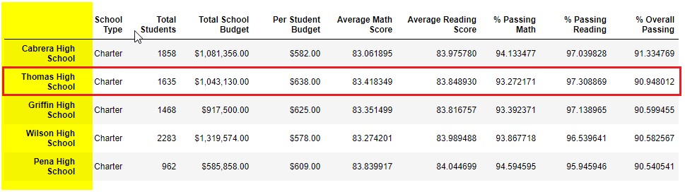

After Remove

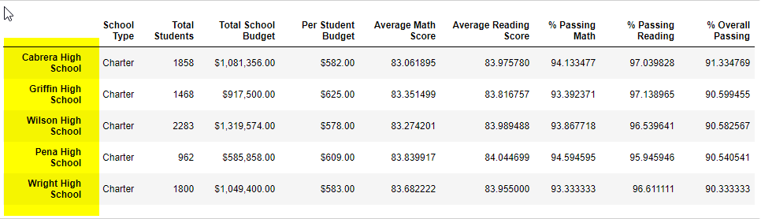

- Thomas school performance is in the second position of the top 5 performing schools before remove. However, Thomas school performance is not in the top 5 performing schools after remove. 
It says that Thomas High's 9th grade scores plays a significant role to place Thomas High in the top 5 performance school. 

#### the bottom 5 performing schools

Before Remove

After Remove

- Thomas school is not in the bottom so its performance is average compare to the district schools

4- How does replacing the ninth-grade scores affect the Math and Reading Scores by Grade, Scores by School Spending, Scores by School Size, and Scores by School Type? 

#### The average Math score received by students in each grade level at each school

Before Remove

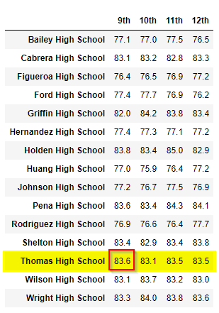

After Remove

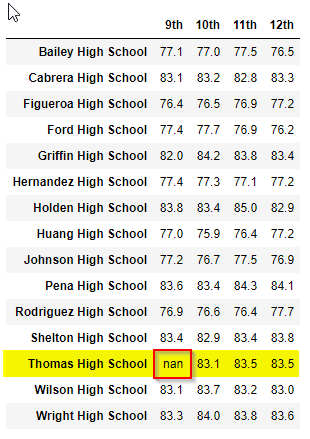

- Math scores averages of Thomas High's 9th grade average is NaN. However, the performing other grades still are comparable and analyzed with other schools.

#### The average Reading score received by students in each grade level at each school

Before Remove

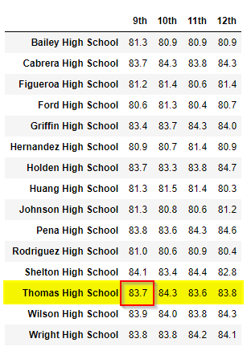

After Remove

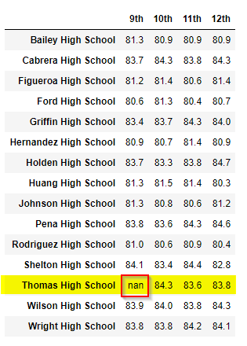

- Reading scores averages of Thomas High's 9th grade average is NaN. However, the performing other grades still are comparable and analyzed with other schools.

#### The school performance based on the spending per student

Before Remove

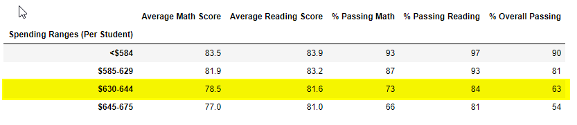

After Remove

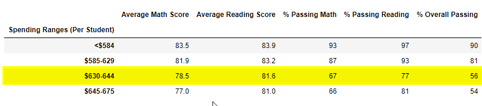

- Thomas High is the range $630-$644 per student of the district budget. Therefore, all metric numbers in the range are impacted because the 9th grade score is removed

#### The school performance based on the size of the school

Before Remove

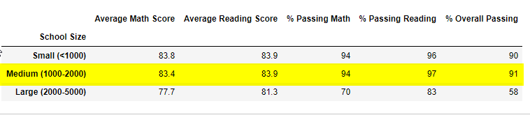

After Remove

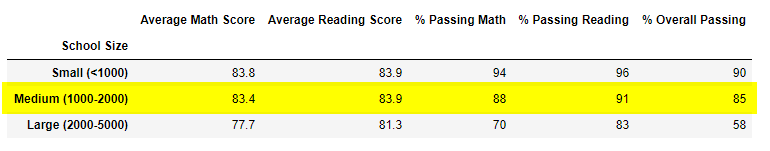

- Thomas High is the size medium (1000-2000) students among the district school. Therefore, all metric numbers in the medium size are impacted because the 9th grade score is removed

#### The school performance based on the type of school

Before Remove

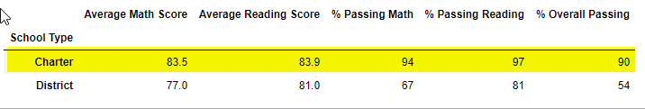

After Remove

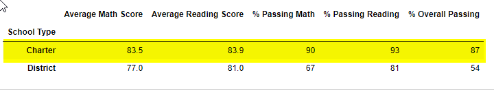

- Thomas High is a charter school. Therefore, all metric numbers in the charter school type are impacted because the 9th grade score is removed
 
